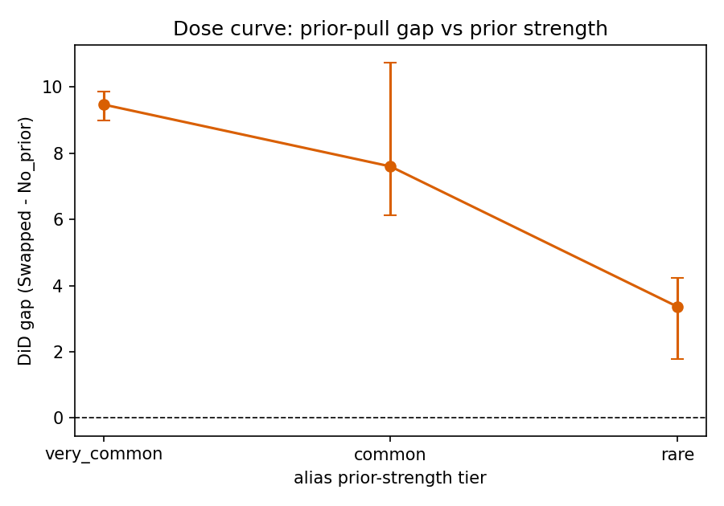

# alias-inertia

A controlled behavioral probe of code language models. When a canonical import alias (`np`, `pd`,
`plt`, ...) is rebound to a different library, for example `import pandas as np`, does the model
track the local binding or revert to the library the alias conventionally denotes? We measure a
**prior-pull** score by continuation scoring and contrast a swapped binding against a no-prior
control, isolating prior reassertion from generic long-context degradation. The accompanying short
paper is in `paper/`. Design rationale: [`alias-inertia_scope.md`](alias-inertia_scope.md).

## Headline result

Across nine model configurations from 0.5B to 8B (base and instruct), the model places more
probability on the alias's conventional methods than on the bound library's. The difference-in-
differences gap (swapped minus no-prior prior-pull) is **+6.81 nats** (95% CI [+4.56, +9.11]), with
every model's interval excluding zero. The gap scales with how common the convention is, is flat
from 0 to 8192 tokens of distance, and surfaces in generated code (74% of swapped completions access
an attribute that does not exist on the bound library).



| Model | Params | Tune | DiD gap [95% CI] |
|---|---|---|---|
| Qwen2.5-0.5B | 0.5B | base | +6.70 [+4.15, +9.05] |
| Qwen2.5-0.5B | 0.5B | inst | +6.93 [+4.33, +9.19] |
| Qwen2.5-0.5B (Q4 GGUF) | 0.5B | inst | +5.51 [+2.41, +9.66] |
| Llama-3.2-1B (Q4 GGUF) | 1B | inst | +7.08 [+2.99, +10.00] |
| Qwen2.5-1.5B | 1.5B | base | +7.46 [+4.64, +10.04] |
| Qwen2.5-1.5B | 1.5B | inst | +7.56 [+4.78, +10.27] |
| Llama-3.2-3B (Q4 GGUF) | 3B | inst | +5.17 [+2.65, +8.72] |
| Qwen2.5-Coder-7B (Q4 GGUF) | 7B | inst | +6.33 [+3.31, +9.63] |
| Llama-3.1-8B (Q4 GGUF) | 8B | inst | +7.33 [+3.73, +10.28] |
| **Overall** | | | **+6.81 [+4.56, +9.11]** |

**Dose slope:** the gap increases by **+3.05 nats per prior-strength tier** (rare -> common ->
very common); pair-clustered bootstrap 95% CI [+1.13, +5.33], 98% of bootstrap slopes positive.
Numbers are in `results/full_analysis.json`, `results/dose_regression.json`, and
`results/raw_prior_pull.json`; provenance in `results/full_manifest.json`.

## Reproduce

```bash
# Anonymous review copy: download and unzip https://anonymous.4open.science/r/pandas-as-pd , then:
cd pandas-as-pd
make env        # install pinned deps (install torch for your platform from pytorch.org first)
make smoke      # ~2-4 min on CPU: verify the whole pipeline on 1 pair + 1 small model
make analyze    # ~1 min: regenerate the figures, statistics, and verdict from released results/
make run        # OPTIONAL, ~6 h: re-score everything from scratch
```

`make analyze` reproduces every figure and statistic from the committed `results/`, so reviewers do
not need the slow scoring run. `make smoke` runs `generate -> score -> analyze` on one pair with
Qwen2.5-0.5B (downloaded on first use, about 1 GB) and prints the sanity checks: a positive swapped
prior-pull on numpy/pandas and the generation and broken-call rates.

### Runtime and the hardware split per stage

| Stage | Time | Hardware |
|---|---|---|
| `make env` | 1-2 min | any |
| `make smoke` | 2-4 min (+ 1 GB download) | CPU (set `device: cuda` in `configs/smoke.yaml` for GPU) |
| `make analyze` | < 1 min | CPU |
| `make run` | about 6 h | GPU fp16 for depths `<=2048` (0.5B, 1.5B); 4-bit GGUF on CPU via Ollama for the 8192-token bins and the 3B/7B/8B models |

`make run` needs Ollama for the CPU path (`ollama pull qwen2.5:0.5b llama3.2:1b llama3.2:3b
qwen2.5-coder:7b llama3.1:8b`); the backend reads each GGUF blob directly. The fp16/GGUF split is
forced by the local GPU lacking a flash/memory-efficient attention kernel; see `REPRODUCIBILITY.md`.

## Layout

```
src/alias_inertia/   package: lexicons, stimuli, scoring, metrics, generation, validity,
                     determinism, backends/ (base, hf, llamacpp)
scripts/             run.py, analyze.py, dose_regression.py, raw_prior_pull.py,
                     gen_stimuli.py, smoke_backend.py
configs/             full.yaml (produced the results), smoke.yaml (fast pipeline check)
results/             scored prefixes (full.parquet), generations, manifest, analysis JSON
figures/             the four paper figures
tests/               8 test modules (51 tests): scoring math, stimuli, metrics, cache, lexicons,
                     generation, validity
paper/               the short paper (acl_latex.tex, custom.bib)
```

Run `make test` (or `python -m pytest -q`) for the test suite. The scoring math is checked against
an independent autoregressive reference on a tiny model that downloads on first run.

## Method in brief

Three conditions for a library pair `(A, B)` with canonical alias `a`: conventional (`import A as a`),
swapped (`import B as a`, so `A` is the prior and `B` is the binding), and no-prior (`import B as zz`,
a non-canonical alias bound to the same library). At the prefix ending `alias.` we score
discriminative continuation strings per library and take prior-pull = logsumexp over the conventional
library's continuations minus logsumexp over the bound library's. Continuation scoring (summed
teacher-forced log-prob of the whole multi-token method string) is used because method names are
multi-token. The headline gap is prior-pull(swapped) minus prior-pull(no-prior). All claims are
behavioral; no mechanistic analysis is included.

## Anonymized release

The anonymous review copy is at https://anonymous.4open.science/r/pandas-as-pd, which hides the
repository owner. The committed files contain no author names, emails, institutions, or tracking
links. A de-anonymized public repository is for the camera-ready version only.

## License

Code is MIT (`LICENSE`). Model weights are not redistributed and carry their own licenses
(Qwen2.5/Qwen2.5-Coder per their model cards; Llama-3.1/3.2 under the Llama Community License). See
`REPRODUCIBILITY.md`.
